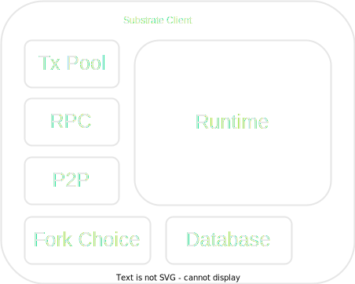
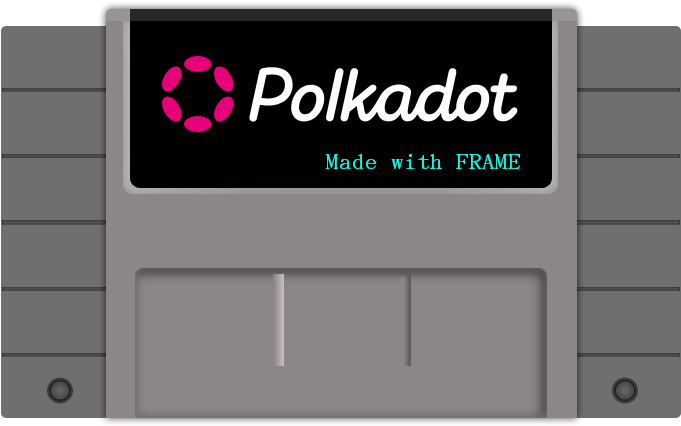
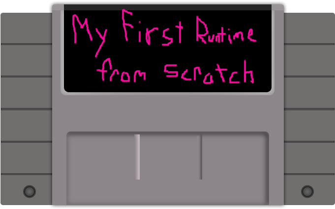
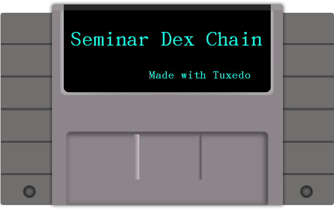
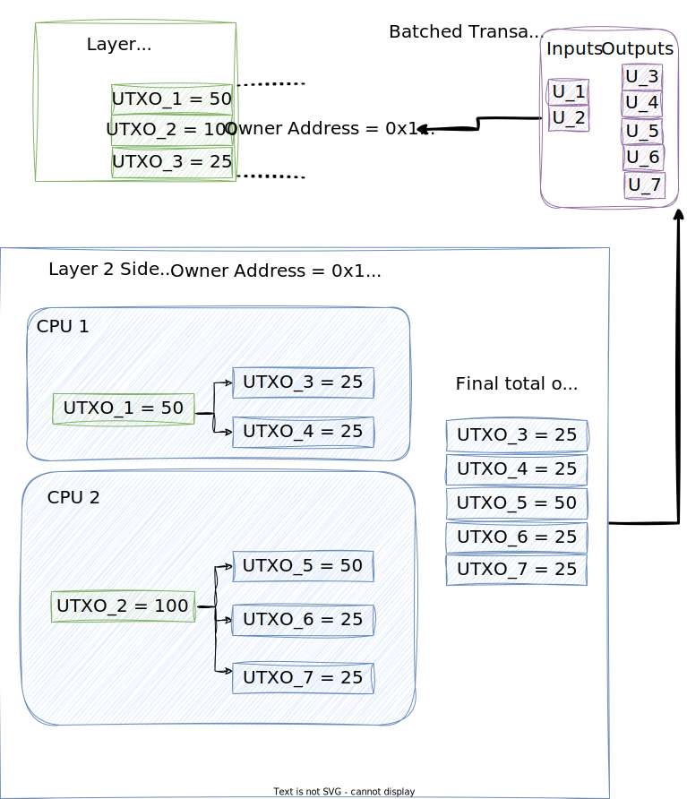

# Tuxedo

Write UTXO-based Substrate Runtimes

---v

## Substrate Seminar

* Started 2019, zoom call, hosted by Joshy
* Migrated to Crowdcast
* Handed off to Dan Forbes
* Handed off to Sacha Lansky
* Migrated to Twitch
* Handed off to Lauren and Aaron


Notes:

Spend ~5 min talking about seminar itself and this new era that Lauren and Aaron are ushering in

Joshy tell story of very first seminar and what a shit show it was and how much seminar has grown and evolved.

---v

## Off-Narrative Labs

<div style="float: left; width: 33%">

Andrew


[Github](https://github.com/coax1d/)

</div>
<div style="float: left; width: 33%">

Off Narrative Labs


[Github](https://github.com/Off-Narrative-Labs/)

</div>
<div style="float: left; width: 33%">

Joshy


[Github](https://github.com/JoshOrndorff/)

</div>

Notes:

Andrew and Joshy each self-intro

For sure talk about meeting at the first academy, doing the UTXO final project, teaching together at the second academy where we met Lauren and Aaron.

---v

## About Tuxedo

Web 3 Grant: https://github.com/w3f/Grants-Program/blob/master/applications/tuxedo.md

Milestones:
- ✅ Core Tuxedo Functionality
- ✅ Template wallet
- 🏗️ Full Documentation and Tutorial

Notes:
This seminar is an opportunity for us to try out or beta test our plan for the docs and tutorial that we will deliver for The third milestone which we plan to submit in about two weeks.

---

# Substrate



Notes:

The client is a normal program that runs natively on a computer. It handles general purpose blockchain administration logic.

* Transaction Pool
* P2P Networking
* Fork Awareness and Management
* RPC Requests

The Runtime is a WebAssembly program that gets executed by the Client.

The client does not have any idea what the runtime does, concretely.
The runtime just implements some API that the client knows how to call.

---v

## Runtime APIs - Core

* [Rust Docs](https://paritytech.github.io/substrate/master/sp_api/trait.Core.html)
* For executing arbitrary blocks
```rust
pub trait Core<Block: BlockT> {
    fn execute_block(
        &self,
        block: Block
    ) -> Result<(), ApiError>;
}
```

---v
## Runtime APIs - BlockBuilder

* [Rust Docs](https://paritytech.github.io/substrate/master/sp_block_builder/trait.BlockBuilder.html)
* For authoring your own blocks

```rust
pub trait BlockBuilder<Block: BlockT> {
  fn initialize_block(
      &self,
      header: &Block::Header
  ) -> Result<(), ApiError>;
  fn apply_extrinsic(
      &self,
      extrinsic: Block::Extrinsic
  ) -> Result<ApplyExtrinsicResult, ApiError>;
  fn finalize_block(
      &self,
  ) -> Result<Block::Header, ApiError>;
}
```

Notes:
This is a slightly idealized version of the way the apis are actually implemented. I've omitted the versions of these functions. Learn more at https://paritytech.github.io/substrate/master/sp_api/trait.RuntimeApiInfo.html. I've also shown `initialize_block` in block builder instead of core. Learn more at https://substrate.stackexchange.com/questions/3128

There are also several other runtime APIs for things like off-chain workers and the transaction pool. These are interesting, but not that important and we're not going to dive into them right now. We've shown the main ones.

There are also things called host functions. These allow the runtime to call back into the client to get help with specific subtasks. These aren't really relevant at the level we're discussing here.

---v

## The Runtime







Notes:

The Runtime represents the application that a particular blockchain runs.

Typically when you dive in to the runtime. This is where people start talking about FRAME and pallets.
But FRAME is just one of many ways to write a runtime. In fact, you can write a runtime entirely from scratch.
All you have to do is implement those runtime apis we saw. We do this at the academy.

* Write runtime from scratch
* Write runtime using FRAME
* Write runtime using Tuxedo
* Hopefully more frameworks to come

Blog analogy:

You can write your blog in plain html if you want to.
You can also use gatsby.
Or Hugo, or Jekyll, or drupal, or whatever.
There will be more blog frameworks in the future that aren't even existing yet.

---

# Accounts vs UTXOs

Steal any content from Andrew's academy lesson?

---v

## Cryptocurrency Example

<div style="display: flex;" >
  <div style="flex: 45%; margin: 30px;">

  Accounts:

  | Address | Balance  |
  | ------- | -------- |
  | 0xA11ce | 50 coins |
  | 0xB0bbb | 10 coins |

  </div>
  <div style="flex: 55%; margin: 30px;">

  UTXOs:

  | Serial | Address | Amount   |
  | ------ | ------- | -------- |
  | 0x1111 | 0xA11ce | 50 coins |
  | 0x2222 | 0xB0bbb | 2 coins  |
  | 0x3333 | 0xB0bbb | 4 coins  |
  | 0x4444 | 0xB0bbb | 4 coins  |

  </div>
</div>

Notes:

First let's consider the example of cryptocurrency.

In the accounts model, each address is mapped to a balance. There is a special storage key for each address that holds the accounts balance. The balance is a single value that is the sum of all the accounts previous dealings.

In the UTXO model, the storage addresses are the coin's serial numbers (which are calculated based on the transaction that includes them). There is no single or global place to check an address's balance. You have to know about all the UTXOs and sum them up.

Having considered this motivating example, lets generalize the big picture differences between the models

---v

## Accounts Model

* Global storage items at known addresses
* On-chain logic must be deterministic
* Transactions execute on latest state
  * And they may put constraints on the state
* On-chain code calculates the final state

---v

## UTXO Model

* All state is local to individual outputs, addresses are based on transaction hash.
* Transactions are fully deterministic
* On-chain code may be non-deterministic
* Transaction specifies exact input state
* Transaction specifies exact final state
* On-chain code just checks that constraints are satisfied

---v

## UTXO for offchain worker/sidechains
* Since in the UTXO model you must in a any given input set only spend a single UTXO we can utilize this for performance.


---v

## Accounts for offchain worker/sidechains

* In comparison it can be quite complicated for the accounts model in this regard.


---v

## Zero-knowledge with UTXOS

* We have some amount of UTXOS (For someone) Utxo1(pubkey, val=1) Utxo2(pubkey, val=2) .. etc
* We want to prove that we can indeed spend 4 without revealing which utxos will be spent or our pubkey.
* So what we want to prove is:
    1. I control a particular key which can spend some number of utxos which can sum to 4
    2. The UTXO/s are infact valid and unspent
    3. The UTXO/s are atleast a value of 4

---v

## Order Book DEX Example

* A Decentralize Exchange
* NOT an Automated Market Maker
* Users trade directly with each other

TODO Diagram of buy and sell orders

More Fundamentals: https://blog.atani.com/dex-orderbook-vs-liquidity-pool/

Notes:
Now let's consider how a more complex application might look in both frameworks.

We will live code on this project together later in the seminar. For now we'll do some design.

Centralized exchanges like Kraken or Poloniex have existed since Mt Gox. They typically operate as an order book. Customers place Orders which are agreements to make a trade of some token for some other token at a given price. The Exchange matches customer orders, and usually gets a profit on the difference, plus sometimes an explicit trading fee.

Decentralized exchanges operate on-chain and eliminate the need to trust the centralized exchange operator. They exist on many chains like Ethereum. On Ethereum they are mostly based on automated market makers. This design is well suited for an accounts model. When two users interact with the DEX around the same time, they don't know which one will be applied first, and therefore, don't know which one will get the better price.

This is not well suited for UTXOs. When sending UTXO transactions, you specify the exact pre-state that you are going to consume. Therefore, you know the exact price you will get and the exact outcome of the transaction. However, it is very inconvenient for users because they are constantly racing to consume the state of the AMM.

In a UTXO setting, it makes more sense to use the order book model that centralized exchanges previously took.

---

# Tuxedo

A **framework** for writing **Substrate Runtimes** that are based on the **UTXO model**.

* Github:
* Rustdocs:

---v

## The Transaction Type

TODO Diagram
TODO Rustdocs link

---v

## The Verifier Trait

TODO Rustdocs link

---v

## The ConstraintChecker Trait

TODO Rustdocs link

---v

## Tuxedo Pieces

Typically a collection a types and constraint checkers. Sometimes some verifiers.

Notes:

Analogous to FRAME pallets.

---v

## Aggregation

TODO rustdocs link

Notes:
This is similar to how FRAME works in many ways, but also different.

There are many outer types. We make the developer explicitly write each outer enum. This is a little more code
but a lot more transparency. In Tuxedo, the aggregation can happen recursively. This allows for packaging collections
of related pieces and configurations together.

---v

## The Executive Type

The `Executive` type is provided by Tuxedo core and implements all the Runtime APIs

---

# Code Walkthrough

Start at the root. Skim the readme. Point out the four main directories.
* Tuxedo-core
* Tuxedo-template-runtime
* node
* wallet

Show the node VERY BRIEFLY only to make the point that it is the typical Substrate node template.
Show the core. Show where it implements the APIs. Talk about the dynamic typing system.
Show the Verifier and ConstraintChecker definitions.
Mention what the wallet is, but don't show the code unless we need to fill time.
Show the runtime. Show that there are many pieces.
Look at the runtime aggregation.


Notes:
At this point we will look away from the slides and shift to the Tuxedo repo. Nonetheless,
I'll sketch the tour route here.

---

# Demo

Run a local node, use the wallet to send some coins, etc TODO better script. Maybe just follow the script in the
wallet readme.

Notes:
This wallet is intended to be extensible so that any tuxedo-based application can implement some hooks and the wallet can track the corresponding state.
We aren't quite there yet. Right now it works well with the cryptocurrency, but some of the logic is still intermixed in the core, and the APIS need better definitions.

---

# Live Code

Let's try to implement the ORder Book DEX we discussed.

This will written out as a full tutorial to complete our third milestone.

Notes:

Would be cool to do a runtime upgrade, but we have never tried that. I'm worried it won't work because we haven't set up opaque extrinsics properly yet. But if we don't change any types. I guess it should work. Let's see if we have time to try it out or not.

Worst case, we start a new `--dev` chain with the new runtime installed and all is well.


---
# Calls to Action

* Try Tuxedo
* Fork / Clone / Star our repo
* Open issues and PRs

Let us know what you want from Tuxedo

Notes:

We would be happy to help you write your runtime until you get the hang of it.
