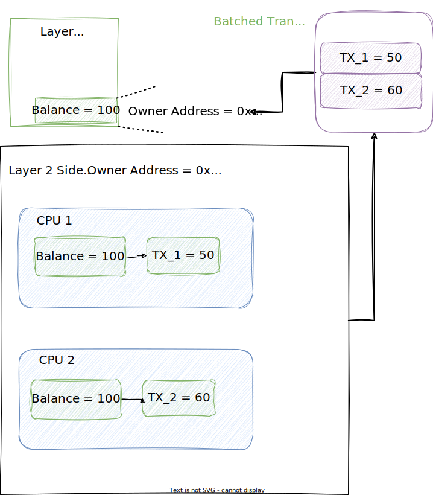

# Tuxedo

Write UTXO-based Substrate Runtimes

---v

## Substrate Seminar

* Started 2019, zoom call, hosted by Joshy
* Migrated to Crowdcast
* Handed off to Dan Forbes
* Handed off to Sacha Lansky
* Migrated to Twitch
* Handed off to Lauren and Aaron

Notes:

Spend ~5 min talking about seminar itself and this new era that Lauren and Aaron are ushering in

Joshy tell story of very first seminar

---v

## About Us

TODO icons etc

Notes:

---

# Substrate

* Client vs Runtime
* TODO Diagram - maybe crib from academy
* Client runs tx pool, consensus, networking
* Runtime is application logic. Like one big smart contract that rules the chain.

---v

## Runtime APIs and Host Functions

---v

## The Runtime

TODO steal Shawn's game console graphics or use something similar

* Write runtime from scratch
* Write runtime using FRAME
* Write runtime using Tuxedo
* Hopefully more frameworks to come

Notes:

Typically when you dive in to the runtime. This is where people start talking about FRAME and pallets.
But FRAME is just one of many ways to write a runtime. In fact, you can write a runtime entirely from scratch.
All you have to do is implement those runtime apis we saw. We do this at the academy.

Blog analogy:

You can write your blog in plain html if you want to.
You can also use gatsby.
Or Hugo, or Jekyll, or drupal, or whatever.
There will be more blog frameworks in the future that aren't even existing yet.

---

# Accounts vs UTXOs

Steal content from Adrew's academy lesson?

---v

## Cryptocurrency Example

TODO describe account based cryptocurrency and utxo base currency

Notes:

First let's consider the example of cryptocurrency

...

Having considered this motivating example, lets generalize the big picture differences between the models

---v

## Accounts Model

* Global storage items at known addresses
* On-chain logic must be deterministic
* Transactions execute on latest state
  * And they may put constraints on the state
* On-chain code calculates the final state

---v

## UTXO Model

* All state is local to individual outputs, addresses are based on transaction hash.
* Transactions are fully deterministic
* On-chain code may be non-deterministic
* Transaction specifies exact input state
* Transaction specifies exact final state
* On-chain code just checks that constraints are satisfied

---v

## UTXO for offchain worker/sidechains
* Since in the UTXO model you must in a any given input set only spend a single UTXO we can utilize this for performance.

---

## Accounts for offchain worker/sidechains

* In comparison it can be quite complicated for the accounts model in this regard.

---

## Zero-knowledge with UTXOS

* We have some amount of UTXOS (For someone) Utxo1(pubkey, val=1) Utxo2(pubkey, val=2) .. etc
* We want to prove that we can indeed spend 4 without revealing which utxos will be spent or our pubkey.
* So what we want to prove is:
    1. I control a particular key which can spend some number of utxos which can sum to 4
    2. The UTXO/s are infact valid and unspent
    3. The UTXO/s are atleast a value of 4

---

## Another Example

TODO Decide which example to use. Some ideas:

* Order Book Dex
* Multisig
* On-chain Voting

Notes:
Now let's consider how a more complex application might look in both frameworks.

Maybe the example we choose here should be the one we live code later.

# Tuxedo

A **framework** for writing **Substrate Runtimes** that are based on the **UTXO model**.

* Github:
* Rustdocs:

---v

## The Transaction Type

TODO Diagram
TODO Rustdocs link

---v

## The Verifier Trait

TODO Rustdocs link

---v

## The ConstraintChecker Trait

TODO Rustdocs link

---v

## Tuxedo Pieces

Typically a collection a types and constraint checkers. Sometimes some verifiers.

Notes:

Analogous to FRAME pallets.

---v

## Aggregation

TODO rustdocs link

Notes:
This is similar to how FRAME works in many ways, but also different.

There are many outer types. We make the developer explicitly write each outer enum. This is a little more code
but a lot more transparency. In Tuxedo, the aggregation can happen recursively. This allows for packaging collections
of related pieces and configurations together.

---v

## The Executive Type

The `Executive` type is provided by Tuxedo core and implements all the Runtime APIs

---

# Code Walkthrough

Start at the root. Skim the readme. Point out the four main directories.
* Tuxedo-core
* Tuxedo-template-runtime
* node
* wallet

Show the node VERY BRIEFLY only to make the point that it is the typical Substrate node template.
Show the core. Show where it implements the APIs. Talk about the dynamic typing system.
Show the Verifier and ConstraintChecker definitions.
Mention what the wallet is, but don't show the code unless we need to fill time.
Show the runtime. Show that there are many pieces.
Look at the runtime aggregation.

Notes:
At this point we will look away from the slides and shift to the Tuxedo repo. Nonetheless,
I'll sketch the tour route here.

---

# Demo

Run a local node, use the wallet to send some coins, etc TODO better script. Maybe just follow the script in the
wallet readme.

Notes:
This wallet is intended to be extensible so that any tuxedo-based application can implement some hooks and the wallet can track the corresponding state.
We aren't quite there yet. Right now it works well with the cryptocurrency, but some of the logic is still intermixed in the core, and the APIS need better definitions.

---

# Live Code

Write a simple Tuxedo piece and add it to the template runtime

Notes:

Would be cool to do a runtime upgrade, but we have never tried that. I'm worried ti won't work because we haven't set up opaque extrinsics properly. But if we don't change any types. I guess it should work. Let's see if we have time to try it out or not.

Worst case we just start a new --dev chain with the new runtime installed.

---
# Calls to Action

* Try Tuxedo
* Fork / Clone / Star our repo
* Open issues and PRs

Let us know what you want from Tuxedo
